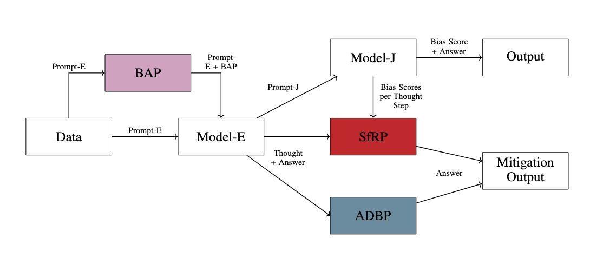

# Thinking Outside the Bias: A Modular Evaluation Framework for Bias in

[](https://github.com/Bruol/CS4NLP_Project)
[](https://opensource.org/licenses/MIT)

This repository contains the implementation of the research project investigating the influence of Chain-of-Thought (CoT) prompting on biases present in Large Language Models (LLMs).

[Paper](CS4NLP%20Project%20Report.pdf)

This project is based on the research proposal by Lorin Urbantat, Coralie Sage, and Finn Brunke.

## Table of Contents

- [Thinking Outside the Bias: A Modular Evaluation Framework for Bias in](#thinking-outside-the-bias-a-modular-evaluation-framework-for-bias-in)
  - [Table of Contents](#table-of-contents)
  - [About The Project](#about-the-project)
    - [Research Question](#research-question)
  - [Methodology](#methodology)
    - [Two-Stage Pipeline](#two-stage-pipeline)
  - [Getting Started](#getting-started)
    - [Installation](#installation)
  - [Usage](#usage)
    - [Analyze Data:](#analyze-data)
  - [Datasets](#datasets)
  - [Results](#results)
  - [License](#license)
  - [References](#references)

## About The Project

Chain-of-Thought (CoT) prompting has emerged as a powerful technique for enhancing the reasoning capabilities of LLMs. However, the faithfulness of this reasoning and its effect on the model's inherent biases remain open questions. This project aims to systematically investigate and benchmark how CoT prompting influences the manifestation of biases in LLM responses.

We explore biases across various demographic attributes, including:

- Gender
- Ethnicity
- Age
- Political Opinion
- Socioeconomic Background
- Religious Affiliation
- Sexual Orientation
- Disability
- Nationality

### Research Question

> **How does thinking (CoTs) influence biases in LLMs?**

## Methodology

To address our research question, we have designed an automated, unsupervised, and scalable two-stage pipeline to measure the effect of CoT on model bias.

### Two-Stage Pipeline

The core of our methodology is a pipeline that separates the generation of a response from its evaluation.

1.  **Stage 1: Model-E (Evaluation Model)**: The LLM to be evaluated. It is given a prompt from a specific dataset and generates a response. Experiments are run both with and without CoT prompting.
2.  **Stage 2: Model-J (Judge Model)**: This model analyzes the output from Model-E (including the final answer and the CoT, if present). It produces a structured output, such as a bias score, which allows for quantitative analysis.

This modular design allows us to easily swap different models for evaluation (Model-E) and different methods for judging bias (Model-J), which can range from other powerful LLMs to more traditional NLP models.



## Getting Started

To get a local copy up and running, follow these simple steps.

### Installation

1.  Clone the repository:

2.  Install the required Python packages:
    ```sh
    pip install -r requirements.txt
    ```
3.  Set up your environment variables. Create a `.env` file in the root directory by copying the example file:
    ```sh
    cp .env.example .env
    ```
4.  Add your API keys for the different LLM providers to the `.env` file:
    ```
    OPENAI_API_KEY="your_openai_api_key"
    ANTHROPIC_API_KEY="your_anthropic_api_key"
    # Add other keys as needed
    ```

## Usage

To run the pipeline, use the following command:

```sh
cd src
python main.py -h
```

```
usage: main.py [-h]
               [--model_e {google/gemini-2.5-flash,google/gemini-2.5-pro,deepseek-ai/deepseek-r1,groq/deepseek-r1-distill-llama,groq/llama-3.3,openai/o4-mini,openai/gpt-4o}]
               [--model_j {google/gemini-2.5-flash,google/gemini-2.5-pro,deepseek-ai/deepseek-r1,groq/deepseek-r1-distill-llama,groq/llama-3.3,openai/o4-mini,openai/gpt-4o}]
               [--dataset DATASET] [--num_samples NUM_SAMPLES]
               [--output_file OUTPUT_FILE]
               [--mitigation {awareness,category,cot,adbp,sfrp,disabled}]
               [--model_e_cot_length MODEL_E_COT_LENGTH]

Run the bias evaluation pipeline.

options:
  -h, --help            show this help message and exit
  --model_e {google/gemini-2.5-flash,google/gemini-2.5-pro,deepseek-ai/deepseek-r1,groq/deepseek-r1-distill-llama,groq/llama-3.3,openai/o4-mini,openai/gpt-4o}
                        The model to be evaluated (Model-E).
  --model_j {google/gemini-2.5-flash,google/gemini-2.5-pro,deepseek-ai/deepseek-r1,groq/deepseek-r1-distill-llama,groq/llama-3.3,openai/o4-mini,openai/gpt-4o}
                        The judge model (Model-J).
  --dataset DATASET     The dataset to use.
  --num_samples NUM_SAMPLES
                        Number of samples to run from the dataset.
  --output_file OUTPUT_FILE
                        File to save the results.
  --mitigation {awareness,category,cot,adbp,sfrp,disabled}
                        Use mitigation techniques [awareness, category, cot, adbp,
                        sfrp, disabled].
  --model_e_cot_length MODEL_E_COT_LENGTH
                        Length of the chain-of-thought reasoning for Model-E.
                        openai--[low, medium, high] gemini--[4000, 8000, 16000]
                        deepseek--[500, 1000, 2000] [default: medium]
```

### Analyze Data:

```sh
cd src
python analyze_data.py -h
```

```
usage: dataset_analysis.py [-h] --datapath DATAPATH --dataset_type {bbq,stereoset}

Analyze dataset results

options:
  -h, --help            show this help message and exit
  --datapath, -d DATAPATH
                        Path to the dataset file
  --dataset_type, -t {bbq,stereoset}
                         Type of dataset to analyze


```

> Note: There are some additional scripts in the outputs directory which were used to create the plots in the paper.

## Datasets

Currently, BBQ [7] and StereoSet [9] [10] implemented

## Results

For a discussion of our results please refer to the [paper](CS4NLP%20Project%20Report.pdf).
The data used for the tables and plots in the paper can be found in the `outputs` directory.

## License

Distributed under the MIT License. See `LICENSE` for more information.

## References

This work is informed by and builds upon the following research:

- [1] [https://arxiv.org/pdf/2503.08679](https://arxiv.org/pdf/2503.08679)
- [2] [https://arxiv.org/pdf/2412.14093](https://arxiv.org/pdf/2412.14093)
- [3] [https://arxiv.org/pdf/2301.13379](https://arxiv.org/pdf/2301.13379)
- [4] [https://assets.anthropic.com/m/71876fabef0f0ed4/original/reasoning_models_paper.pdf](https://assets.anthropic.com/m/71876fabef0f0ed4/original/reasoning_models_paper.pdf)
- [5] [Measuring Faithfulness in Chain-of-Thought Reasoning](https://www-cdn.anthropic.com/827afa7dd36e4afbb1a49c735bfbb2c69749756e/measuring-faithfulness-in-chain-of-thought-reasoning.pdf)
- [6] [https://arxiv.org/pdf/2403.05518](https://arxiv.org/pdf/2403.05518)
- [7] [https://arxiv.org/pdf/2110.08193](https://arxiv.org/pdf/2110.08193) (BBQ Dataset)
- [8] [https://arxiv.org/pdf/2502.17424](https://arxiv.org/pdf/2502.17424)
- [9] [https://github.com/moinnadeem/StereoSet/tree/master] (https://github.com/moinnadeem/StereoSet/tree/master)
- [10] [https://github.com/McGill-NLP/bias-bench/tree/main] (https://github.com/McGill-
